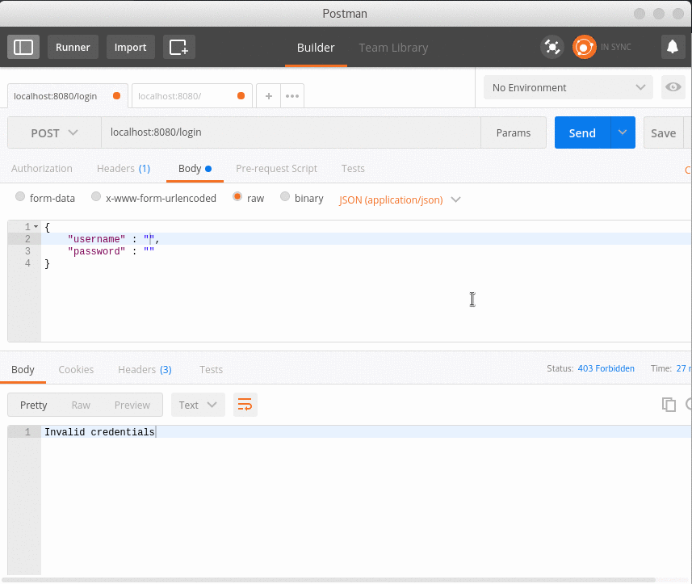

```go
// New returns a new Negroni instance with no middleware preconfigured.
func New(handlers ...Handler) *Negroni {
	return &Negroni{
		handlers:   handlers,
		middleware: build(handlers),
	}
}
```

## Bekerja dengan lib/pq
postgres=#
`create user gopher with password 'gopass';`
`create database gobasedb owner gopher;`

atau:

```sql
CREATE DATABASE gobasedb
  WITH OWNER = gopher
       ENCODING = 'UTF8'
       TABLESPACE = pg_default
       LC_COLLATE = 'en_US.UTF-8'
       LC_CTYPE = 'en_US.UTF-8'
       CONNECTION LIMIT = -1;
```